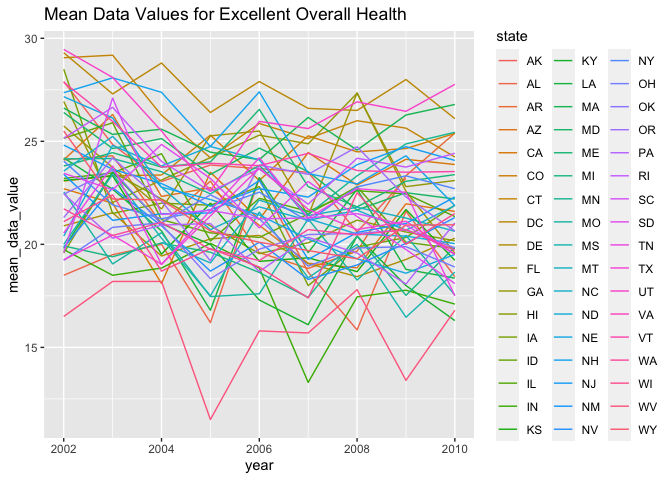

p8105_hw3_sh4354
================
Selina Hsuan
2023-10-10

Load libraries

``` r
library(tidyverse)
```

    ## ── Attaching core tidyverse packages ──────────────────────── tidyverse 2.0.0 ──
    ## ✔ dplyr     1.1.3     ✔ readr     2.1.4
    ## ✔ forcats   1.0.0     ✔ stringr   1.5.0
    ## ✔ ggplot2   3.4.3     ✔ tibble    3.2.1
    ## ✔ lubridate 1.9.2     ✔ tidyr     1.3.0
    ## ✔ purrr     1.0.2     
    ## ── Conflicts ────────────────────────────────────────── tidyverse_conflicts() ──
    ## ✖ dplyr::filter() masks stats::filter()
    ## ✖ dplyr::lag()    masks stats::lag()
    ## ℹ Use the conflicted package (<http://conflicted.r-lib.org/>) to force all conflicts to become errors

``` r
library(p8105.datasets)
```

## PROBLEM 1

``` r
data("instacart")
```

The dataset `instacart` consists of 15 variables and 1384617
observations. It describes the products ordered through Instacart for
several order numbers.

``` r
instacart |> 
  count(aisle) |> 
  arrange(desc(n)) |> 
  drop_na(aisle)
```

    ## # A tibble: 134 × 2
    ##    aisle                              n
    ##    <chr>                          <int>
    ##  1 fresh vegetables              150609
    ##  2 fresh fruits                  150473
    ##  3 packaged vegetables fruits     78493
    ##  4 yogurt                         55240
    ##  5 packaged cheese                41699
    ##  6 water seltzer sparkling water  36617
    ##  7 milk                           32644
    ##  8 chips pretzels                 31269
    ##  9 soy lactosefree                26240
    ## 10 bread                          23635
    ## # ℹ 124 more rows

There are 124 aisles. The most items are ordered form fresh vegetales
aisle.

## PROBLEM 2

Load BRFSS dataset

``` r
data("brfss_smart2010")
```

Clean dataset

``` r
brfss_df = 
  brfss_smart2010 |> 
  janitor::clean_names() |> 
  separate(locationdesc, into = c("state", "county"), " - ") |> 
  select(-locationabbr) |> 
  filter(topic == "Overall Health") |> 
  arrange(response) |> 
  mutate(
    response = fct_relevel(response, c("Poor", "Fair", "Good", "Very good", "Excellent"))
  )
```

States observed at 7 or more locations in 2022

``` r
brfss_df |> 
  filter(year == 2002) |> 
  group_by(state) |> 
  summarize(n_location = n()) |> 
  filter(n_location >=7)
```

    ## # A tibble: 36 × 2
    ##    state n_location
    ##    <chr>      <int>
    ##  1 AZ            10
    ##  2 CO            20
    ##  3 CT            35
    ##  4 DE            15
    ##  5 FL            35
    ##  6 GA            15
    ##  7 HI            20
    ##  8 ID            10
    ##  9 IL            15
    ## 10 IN            10
    ## # ℹ 26 more rows

In 2002, 36 states were observed at 7 or more locations.

States observed at 7 or more locations in 2010

``` r
brfss_df |> 
  filter(year == 2010) |> 
  group_by(state) |> 
  summarize(n_location = n()) |> 
  filter(n_location >=7)
```

    ## # A tibble: 45 × 2
    ##    state n_location
    ##    <chr>      <int>
    ##  1 AL            15
    ##  2 AR            15
    ##  3 AZ            15
    ##  4 CA            60
    ##  5 CO            35
    ##  6 CT            25
    ##  7 DE            15
    ##  8 FL           205
    ##  9 GA            20
    ## 10 HI            20
    ## # ℹ 35 more rows

In 2010, 45 states were observed at 7 or more locations.

Create datafrome \[excellent_df\]

``` r
excellent_df = 
  brfss_df |>
  filter(response == "Excellent") |> 
  group_by(year, state) |> 
  mutate(mean_data_value = mean(data_value, na.rm = TRUE)) |> 
  select (year, state, mean_data_value) |> 
  distinct()
```

Make spagetti plot of \[excellent_df\]

``` r
excellent_df |> 
  ggplot(aes(x = year, y = mean_data_value, color = state)) + 
  geom_line() +
  labs(title = "Mean Data Values for Excellent Overall Health")
```

<!-- -->

The spagetti plot shows the mean data values for excellent overall
health in each state from 2022 to 2010.

``` r
nyc_df =
  brfss_df |>
  filter((year == 2006 | year == 2010) & state == "NY") |>
  select(year, response, data_value, county)
  
nyc_df |>
  ggplot(aes(x=response, y=data_value)) +
  geom_point() +
  facet_grid(. ~ year) + 
  labs(title = "NY State Overall Health")
```

<!-- -->

The 2-panel plot shows the distribution of data values for each reponse
from “poor” to “excellent” in NY state countries in the year 2006 and
2010.

## PROBLEM 3

Clean demographic data

``` r
demographic_df = 
  read_csv("./data/nhanes_covar.csv", skip = 4, na = ".") |> 
  janitor::clean_names() |> 
  mutate(
    sex = case_match(sex,
      1 ~ "male",
      2 ~ "female"),
    education = case_match(education,
      "1" ~ "less than high school",
      "2" ~ "high school equivalent", 
      "3" ~ "more than high school"),
    education = fct_relevel(education, 
      c("less than high school", "high school equivalent", "more than high school"))
  ) |> 
  filter(age >= 21) |> 
  drop_na()
```

    ## Rows: 250 Columns: 5
    ## ── Column specification ────────────────────────────────────────────────────────
    ## Delimiter: ","
    ## chr (2): BMI, education
    ## dbl (3): SEQN, sex, age
    ## 
    ## ℹ Use `spec()` to retrieve the full column specification for this data.
    ## ℹ Specify the column types or set `show_col_types = FALSE` to quiet this message.

Clean accelorometer data

``` r
accelorometer_df = 
  read_csv("./data/nhanes_accel.csv") |> 
  janitor::clean_names() |> 
  pivot_longer(
    min1:min1440,
    names_to = "minute",
    names_prefix = "min",
    values_to = "mims"
  ) 
```

    ## Rows: 250 Columns: 1441
    ## ── Column specification ────────────────────────────────────────────────────────
    ## Delimiter: ","
    ## dbl (1441): SEQN, min1, min2, min3, min4, min5, min6, min7, min8, min9, min1...
    ## 
    ## ℹ Use `spec()` to retrieve the full column specification for this data.
    ## ℹ Specify the column types or set `show_col_types = FALSE` to quiet this message.

Merge demographic and accelorometer data

``` r
nhanes_df = 
  inner_join(demographic_df, accelorometer_df)
```

    ## Joining with `by = join_by(seqn)`
