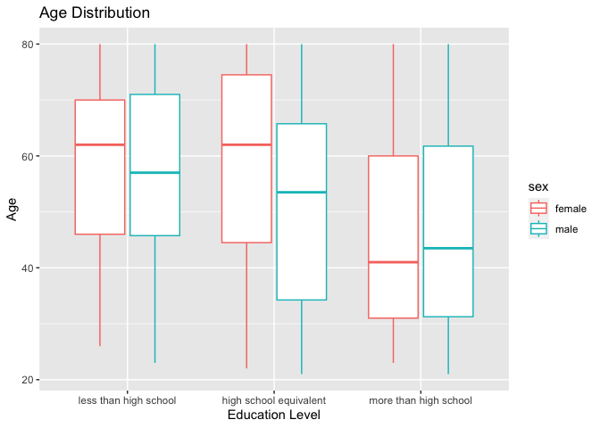

p8105_hw3_sh4354
================
Selina Hsuan
2023-10-10

``` r
library(tidyverse)
library(p8105.datasets)
```

## PROBLEM 1

``` r
data("instacart")
```

The dataset `instacart` consists of 15 variables and 1384617
observations. It describes the products ordered through Instacart for
several order numbers.

``` r
instacart |> 
  count(aisle) |> 
  arrange(desc(n)) |> 
  drop_na(aisle)
## # A tibble: 134 × 2
##    aisle                              n
##    <chr>                          <int>
##  1 fresh vegetables              150609
##  2 fresh fruits                  150473
##  3 packaged vegetables fruits     78493
##  4 yogurt                         55240
##  5 packaged cheese                41699
##  6 water seltzer sparkling water  36617
##  7 milk                           32644
##  8 chips pretzels                 31269
##  9 soy lactosefree                26240
## 10 bread                          23635
## # ℹ 124 more rows
```

There are 124 aisles. The most items are ordered form fresh vegetales
aisle.

Next, we create a plot showing the number of items ordered in each
aisle, limiting this to aisles with more than 10000 items ordered.

``` r
instacart |> 
  count(aisle) |> 
  filter(n > 10000) |> 
  mutate(aisle = fct_reorder(aisle, n)) |> 
  ggplot(aes(x = aisle, y = n)) + 
  geom_point() + 
  labs(title = "Number of items ordered in each aisle") +
  theme(axis.text.x = element_text(angle = 60, hjust = 1))
```

<!-- -->

Now we make a table showing the three most popular items in each of the
aisles “baking ingredients”, “dog food care”, and “packaged vegetables
fruits.”

``` r
instacart |> 
  filter(aisle %in% c("baking ingredients", "dog food care", "packaged vegetables fruits")) |>
  group_by(aisle) |> 
  count(product_name) |> 
  mutate(rank = min_rank(desc(n))) |> 
  filter(rank < 4) |> 
  arrange(desc(n)) |>
  knitr::kable()
```

| aisle                      | product_name                                  |    n | rank |
|:---------------------------|:----------------------------------------------|-----:|-----:|
| packaged vegetables fruits | Organic Baby Spinach                          | 9784 |    1 |
| packaged vegetables fruits | Organic Raspberries                           | 5546 |    2 |
| packaged vegetables fruits | Organic Blueberries                           | 4966 |    3 |
| baking ingredients         | Light Brown Sugar                             |  499 |    1 |
| baking ingredients         | Pure Baking Soda                              |  387 |    2 |
| baking ingredients         | Cane Sugar                                    |  336 |    3 |
| dog food care              | Snack Sticks Chicken & Rice Recipe Dog Treats |   30 |    1 |
| dog food care              | Organix Chicken & Brown Rice Recipe           |   28 |    2 |
| dog food care              | Small Dog Biscuits                            |   26 |    3 |

Finally, we make a table showing the mean hour of the day at which Pink
Lady Apples and Coffee Ice Cream are ordered on each day of the week.

``` r
instacart |>
  filter(product_name %in% c("Pink Lady Apples", "Coffee Ice Cream")) |>
  group_by(product_name, order_dow) |>
  summarize(mean_hour = mean(order_hour_of_day)) |>
  pivot_wider(
    names_from = order_dow, 
    values_from = mean_hour) |>
  knitr::kable(digits = 2)
```

| product_name     |     0 |     1 |     2 |     3 |     4 |     5 |     6 |
|:-----------------|------:|------:|------:|------:|------:|------:|------:|
| Coffee Ice Cream | 13.77 | 14.32 | 15.38 | 15.32 | 15.22 | 12.26 | 13.83 |
| Pink Lady Apples | 13.44 | 11.36 | 11.70 | 14.25 | 11.55 | 12.78 | 11.94 |

## PROBLEM 2

Load BRFSS dataset

``` r
data("brfss_smart2010")
```

Clean dataset

``` r
brfss_df = 
  brfss_smart2010 |> 
  janitor::clean_names() |> 
  separate(locationdesc, into = c("state", "county"), " - ") |> 
  select(-locationabbr) |> 
  filter(topic == "Overall Health") |> 
  arrange(response) |> 
  mutate(
    response = fct_relevel(response, c("Poor", "Fair", "Good", "Very good", "Excellent"))
  )
```

States observed at 7 or more locations in 2022

``` r
brfss_df |> 
  filter(year == 2002) |> 
  group_by(state) |> 
  summarize(n_location = n()) |> 
  filter(n_location >=7)
## # A tibble: 36 × 2
##    state n_location
##    <chr>      <int>
##  1 AZ            10
##  2 CO            20
##  3 CT            35
##  4 DE            15
##  5 FL            35
##  6 GA            15
##  7 HI            20
##  8 ID            10
##  9 IL            15
## 10 IN            10
## # ℹ 26 more rows
```

In 2002, 36 states were observed at 7 or more locations.

States observed at 7 or more locations in 2010

``` r
brfss_df |> 
  filter(year == 2010) |> 
  group_by(state) |> 
  summarize(n_location = n()) |> 
  filter(n_location >=7)
## # A tibble: 45 × 2
##    state n_location
##    <chr>      <int>
##  1 AL            15
##  2 AR            15
##  3 AZ            15
##  4 CA            60
##  5 CO            35
##  6 CT            25
##  7 DE            15
##  8 FL           205
##  9 GA            20
## 10 HI            20
## # ℹ 35 more rows
```

In 2010, 45 states were observed at 7 or more locations.

Create datafrome \[excellent_df\]

``` r
excellent_df = 
  brfss_df |>
  filter(response == "Excellent") |> 
  group_by(year, state) |> 
  mutate(mean_data_value = mean(data_value, na.rm = TRUE)) |> 
  select (year, state, mean_data_value) |> 
  distinct()
```

Make spagetti plot of \[excellent_df\]

``` r
excellent_df |> 
  ggplot(aes(x = year, y = mean_data_value, color = state)) + 
  geom_line() +
  labs(title = "Mean Data Values for Excellent Overall Health")
```

<!-- -->

The spagetti plot shows the mean data values for excellent overall
health in each state from 2022 to 2010.

``` r
nyc_df =
  brfss_df |>
  filter((year == 2006 | year == 2010) & state == "NY") |>
  select(year, response, data_value, county)
  
nyc_df |>
  ggplot(aes(x=response, y=data_value)) +
  geom_point() +
  facet_grid(. ~ year) + 
  labs(title = "NY State Overall Health")
```

<!-- -->

The 2-panel plot shows the distribution of data values for each reponse
from “poor” to “excellent” in NY state countries in the year 2006 and
2010.

## PROBLEM 3

Clean demographic data

``` r
demographic_df = 
  read_csv("./data/nhanes_covar.csv", skip = 4, na = ".") |> 
  janitor::clean_names() |> 
  mutate(
    sex = case_match(sex,
      1 ~ "male",
      2 ~ "female"),
    education = case_match(education,
      "1" ~ "less than high school",
      "2" ~ "high school equivalent", 
      "3" ~ "more than high school"),
    education = fct_relevel(education, 
      c("less than high school", "high school equivalent", "more than high school"))
  ) |> 
  filter(age >= 21) |> 
  drop_na()
```

Clean accelorometer data

``` r
accelorometer_df = 
  read_csv("./data/nhanes_accel.csv") |> 
  janitor::clean_names() |> 
  pivot_longer(
    min1:min1440,
    names_to = "minute",
    names_prefix = "min",
    values_to = "mims"
  ) 
```

Merge demographic and accelorometer data

``` r
nhanes_df = 
  inner_join(demographic_df, accelorometer_df)
```

Education table

``` r
demographic_df |> 
  group_by(education, sex) |> 
  summarize(n_sex = n()) |> 
  pivot_wider(
    names_from = sex,
    values_from = n_sex
  ) |> 
  knitr::kable()
```

| education              | female | male |
|:-----------------------|-------:|-----:|
| less than high school  |     29 |   28 |
| high school equivalent |     23 |   36 |
| more than high school  |     59 |   56 |

Age distribution by sex

``` r
demographic_df |> 
  ggplot(aes(x = education, y = age, color = sex)) + 
  geom_boxplot() +
  labs(title = "Age Distribution")
```

<!-- -->

Total Activity

``` r
nhanes_df |> 
  group_by(seqn, age, sex, education) |> 
  summarize(total_activity = sum(mims)) |> 
  ggplot(aes(x = age, y = total_activity, color = sex)) + 
  geom_point() +
  geom_smooth() +
  facet_grid(. ~ education) + 
  labs(title = "Total Activity")
```

<!-- -->

Activity over the course of day

``` r
nhanes_df |>
  mutate(
    minute = as.numeric(minute)
  ) |> 
  ggplot(aes(x = minute, y = mims, color = sex)) + 
  geom_point(alpha = 0.5) +
  facet_grid(. ~ education) + 
  labs(title = "Activity Over the Course of a Day")
```

<!-- -->
