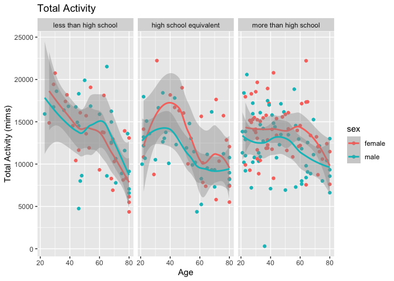

Homework 3
================
Selina Hsuan
2023-10-10

``` r
library(tidyverse)
library(p8105.datasets)
```

## PROBLEM 1

``` r
data("instacart")
```

The dataset `instacart` consists of 15 variables and 1384617
observations. It describes the products ordered through Instacart for
several order numbers.

``` r
instacart |> 
  count(aisle) |> 
  arrange(desc(n)) |> 
  drop_na(aisle)
## # A tibble: 134 × 2
##    aisle                              n
##    <chr>                          <int>
##  1 fresh vegetables              150609
##  2 fresh fruits                  150473
##  3 packaged vegetables fruits     78493
##  4 yogurt                         55240
##  5 packaged cheese                41699
##  6 water seltzer sparkling water  36617
##  7 milk                           32644
##  8 chips pretzels                 31269
##  9 soy lactosefree                26240
## 10 bread                          23635
## # ℹ 124 more rows
```

There are 124 aisles. The most items are ordered form fresh vegetales
aisle.

Next, we create a plot showing the number of items ordered in each
aisle, limiting this to aisles with more than 10000 items ordered.

``` r
instacart |> 
  count(aisle) |> 
  filter(n > 10000) |> 
  mutate(aisle = fct_reorder(aisle, n)) |> 
  ggplot(aes(x = aisle, y = n)) + 
  geom_point() + 
  labs(title = "Number of items ordered in each aisle") +
  theme(axis.text.x = element_text(angle = 60, hjust = 1))
```

<!-- -->

Now we make a table showing the three most popular items in each of the
aisles “baking ingredients”, “dog food care”, and “packaged vegetables
fruits.”

``` r
instacart |> 
  filter(aisle %in% c("baking ingredients", "dog food care", "packaged vegetables fruits")) |>
  group_by(aisle) |> 
  count(product_name) |> 
  mutate(rank = min_rank(desc(n))) |> 
  filter(rank < 4) |> 
  arrange(desc(n)) |>
  knitr::kable()
```

| aisle                      | product_name                                  |    n | rank |
|:---------------------------|:----------------------------------------------|-----:|-----:|
| packaged vegetables fruits | Organic Baby Spinach                          | 9784 |    1 |
| packaged vegetables fruits | Organic Raspberries                           | 5546 |    2 |
| packaged vegetables fruits | Organic Blueberries                           | 4966 |    3 |
| baking ingredients         | Light Brown Sugar                             |  499 |    1 |
| baking ingredients         | Pure Baking Soda                              |  387 |    2 |
| baking ingredients         | Cane Sugar                                    |  336 |    3 |
| dog food care              | Snack Sticks Chicken & Rice Recipe Dog Treats |   30 |    1 |
| dog food care              | Organix Chicken & Brown Rice Recipe           |   28 |    2 |
| dog food care              | Small Dog Biscuits                            |   26 |    3 |

Finally, we make a table showing the mean hour of the day at which Pink
Lady Apples and Coffee Ice Cream are ordered on each day of the week.

``` r
instacart |>
  filter(product_name %in% c("Pink Lady Apples", "Coffee Ice Cream")) |>
  group_by(product_name, order_dow) |>
  summarize(mean_hour = mean(order_hour_of_day)) |>
  pivot_wider(
    names_from = order_dow, 
    values_from = mean_hour) |>
  knitr::kable(digits = 2)
```

| product_name     |     0 |     1 |     2 |     3 |     4 |     5 |     6 |
|:-----------------|------:|------:|------:|------:|------:|------:|------:|
| Coffee Ice Cream | 13.77 | 14.32 | 15.38 | 15.32 | 15.22 | 12.26 | 13.83 |
| Pink Lady Apples | 13.44 | 11.36 | 11.70 | 14.25 | 11.55 | 12.78 | 11.94 |

## PROBLEM 2

``` r
data("brfss_smart2010")
```

First, we do some data cleaning for BRFSS.

``` r
brfss_df = 
  brfss_smart2010 |> 
  janitor::clean_names() |> 
  separate(locationdesc, into = c("state", "county"), " - ") |> 
  select(-locationabbr) |> 
  filter(topic == "Overall Health") |> 
  arrange(response) |> 
  mutate(
    response = fct_relevel(response, c("Poor", "Fair", "Good", "Very good", "Excellent"))
  )
```

The next code chunk determines which states were observed at 7 or more
locations in 2002.

``` r
brfss_df |> 
  filter(year == 2002) |> 
  group_by(state) |> 
  summarize(n_location = n()) |> 
  filter(n_location >=7) |> 
  knitr::kable()
```

| state | n_location |
|:------|-----------:|
| AZ    |         10 |
| CO    |         20 |
| CT    |         35 |
| DE    |         15 |
| FL    |         35 |
| GA    |         15 |
| HI    |         20 |
| ID    |         10 |
| IL    |         15 |
| IN    |         10 |
| KS    |         15 |
| LA    |         15 |
| MA    |         40 |
| MD    |         30 |
| ME    |         10 |
| MI    |         20 |
| MN    |         20 |
| MO    |         10 |
| NC    |         35 |
| NE    |         15 |
| NH    |         25 |
| NJ    |         40 |
| NV    |         10 |
| NY    |         25 |
| OH    |         20 |
| OK    |         15 |
| OR    |         15 |
| PA    |         50 |
| RI    |         20 |
| SC    |         15 |
| SD    |         10 |
| TN    |         10 |
| TX    |         10 |
| UT    |         25 |
| VT    |         15 |
| WA    |         20 |

Similarly, this code chunk determines which states were observed at 7 or
more locations in 2010.

``` r
brfss_df |> 
  filter(year == 2010) |> 
  group_by(state) |> 
  summarize(n_location = n()) |> 
  filter(n_location >=7) |> 
  knitr::kable()
```

| state | n_location |
|:------|-----------:|
| AL    |         15 |
| AR    |         15 |
| AZ    |         15 |
| CA    |         60 |
| CO    |         35 |
| CT    |         25 |
| DE    |         15 |
| FL    |        205 |
| GA    |         20 |
| HI    |         20 |
| IA    |         10 |
| ID    |         30 |
| IL    |         10 |
| IN    |         15 |
| KS    |         20 |
| LA    |         25 |
| MA    |         45 |
| MD    |         60 |
| ME    |         30 |
| MI    |         20 |
| MN    |         25 |
| MO    |         15 |
| MS    |         10 |
| MT    |         15 |
| NC    |         60 |
| ND    |         15 |
| NE    |         50 |
| NH    |         25 |
| NJ    |         95 |
| NM    |         30 |
| NV    |         10 |
| NY    |         45 |
| OH    |         40 |
| OK    |         15 |
| OR    |         20 |
| PA    |         35 |
| RI    |         25 |
| SC    |         35 |
| SD    |         10 |
| TN    |         25 |
| TX    |         80 |
| UT    |         30 |
| VT    |         30 |
| WA    |         50 |
| WY    |         10 |

In 2002, 36 states were observed at 7 or more locations. In 2010, 45
states were observed at 7 or more locations.

Now we construct a dataset that is limited to “excellent” responses and
contains, year, state, and data value average across locations within a
state.

``` r
excellent_df = 
  brfss_df |>
  filter(response == "Excellent") |> 
  group_by(year, state) |> 
  mutate(mean_data_value = mean(data_value, na.rm = TRUE)) |> 
  select (year, state, mean_data_value) |> 
  distinct()
```

Here is a spagetti plot of average data values over time within each
state.

``` r
excellent_df |> 
  ggplot(aes(x = year, y = mean_data_value, color = state)) + 
  geom_line() +
  labs(title = "Mean Data Values for Excellent Overall Health", 
        x = "Year",
        y = "Mean Data Value")
```

<!-- -->

The spagetti plot shows the mean data values for excellent overall
health in each state from 2022 to 2010. The mean data values during this
time period range primarily between 15 and 30.

Now we make a two-panel plot showing, for the years 2006, and 2010, the
distribution of data values for responses (“Poor” to “Excellent”) among
locations in NY State

``` r
nyc_df =
  brfss_df |>
  filter((year == 2006 | year == 2010) & state == "NY") |>
  select(year, response, data_value, county)
  
nyc_df |>
  ggplot(aes(x=response, y=data_value)) +
  geom_point() +
  facet_grid(. ~ year) + 
  labs(title = "NY State Overall Health", 
        x = "Response",
        y = "Data Value")
```

<!-- -->

The 2-panel plot shows the distribution of data values for each reponse
from “poor” to “excellent” in NY state countries in the year 2006 and
2010. In both 2006 and 2010, the data values increase overall from
“poor” to “good”/“very good” health. However, the data values decrease
overall from “very good health” to “excellent health.”.

## PROBLEM 3

First, we load and tidy NHANES demographic data.

``` r
demographic_df = 
  read_csv("./data/nhanes_covar.csv", skip = 4, na = ".") |> 
  janitor::clean_names() |> 
  mutate(
    sex = case_match(sex,
      1 ~ "male",
      2 ~ "female"),
    education = case_match(education,
      "1" ~ "less than high school",
      "2" ~ "high school equivalent", 
      "3" ~ "more than high school"),
    education = fct_relevel(education, 
      c("less than high school", "high school equivalent", "more than high school"))
  ) |> 
  filter(age >= 21) |> 
  drop_na()
```

Next, we load and tidy NHANEs accelorometer data.

``` r
accelorometer_df = 
  read_csv("./data/nhanes_accel.csv") |> 
  janitor::clean_names() |> 
  pivot_longer(
    min1:min1440,
    names_to = "minute",
    names_prefix = "min",
    values_to = "mims"
  ) 
```

Now, we merge the tidied demographic and accelorometer data .

``` r
nhanes_df = 
  inner_join(demographic_df, accelorometer_df)
```

Here is a table of the number of men and women in each education
category.

``` r
demographic_df |> 
  group_by(education, sex) |> 
  summarize(n_sex = n()) |> 
  pivot_wider(
    names_from = sex,
    values_from = n_sex
  ) |> 
  knitr::kable()
```

| education              | female | male |
|:-----------------------|-------:|-----:|
| less than high school  |     29 |   28 |
| high school equivalent |     23 |   36 |
| more than high school  |     59 |   56 |

The table shows that there is roughly the same number of females and
males in the study with less than a high school education. There are
more males than females with a high school equivalent education. There
are slightly more females than males with more than a high school
education.

Here is a visualization of the age distributions for men and women in
each education category.

``` r
demographic_df |> 
  ggplot(aes(x = education, y = age, color = sex)) + 
  geom_boxplot() +
  labs(title = "Age Distribution", 
        x = "Education Level",
        y = "Age")
```

<!-- -->

The boxplot shows the min, max, Q1, Q3, and median ages of males and
females for each level of education. Females with less than a high
school education have a higher median age than males with less than a
high school education. Females with a high school equivalent education
have a higher median age than males with a high school equivalent
education. Females with more than a high school education have a
slightly lower median age than males with more than a high school
education. The plot demonstrates that the median age is lowest for males
and females with more than a high school education. The median age is
roughly the same for females with less than a high school education and
a high school equivalent education, as well as males with less than a
high school education and a high school equivalent education.

Next, we create a plot to represent total activity.

``` r
nhanes_df |> 
  group_by(seqn, age, sex, education) |> 
  summarize(total_activity = sum(mims)) |> 
  ggplot(aes(x = age, y = total_activity, color = sex)) + 
  geom_point() +
  geom_smooth() +
  facet_grid(. ~ education) + 
  labs(title = "Total Activity", 
        x = "Age",
        y = "Total Activity (mims)")
```

<!-- -->

The plot above shows that total activity decreases as age increases for
males and females of all education levels. For participants with less
than a high school education, total activity is generally higher for
females until around age 50, at which total activity becomes higher for
males. For participants with a high school equivalent and more than high
school education, total activity is generally higher for females across
all ages.

Finally, we create a plot to represent activity over the course of day.

``` r
nhanes_df |>
  mutate(
    minute = as.numeric(minute)
  ) |> 
  ggplot(aes(x = minute, y = mims, color = sex)) + 
  geom_point(alpha = 0.5) +
  facet_grid(. ~ education) + 
  labs(title = "Activity Over the Course of a Day", 
        x = "Minute of the Day",
        y = "Activity (mims)")
```

<!-- -->

The plot above demonstrates that across all education levels and sex,
activity peaks around minute 500 (presumably when participants wake up)
and decreases throughout the day. Activity is lowest right before minute
(presumably when participants sleep). Activity over the course of a day
is roughly the same for males and females with less than a high school
and high school equivalent education. For participants with more than a
high school education, activity is noticeably higher around minute 500,
particularly for females, and activity is noticeably higher around
minute 1250 for males only.
